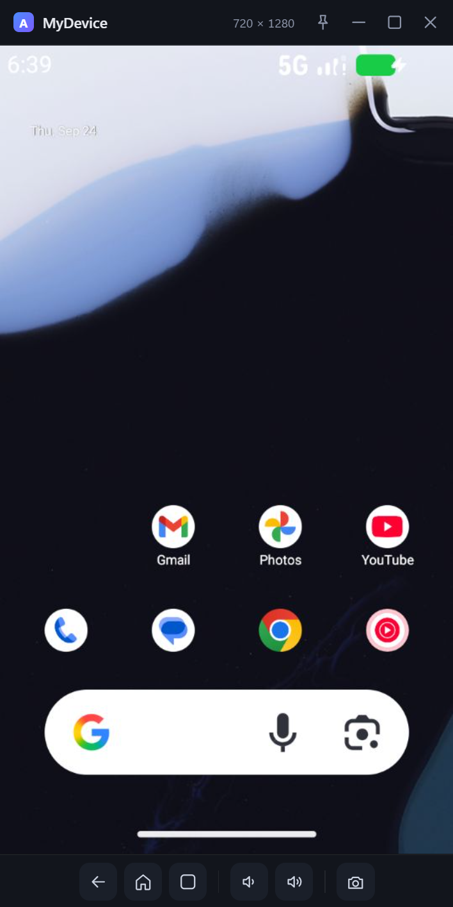

# WebView 设备窗口（自定义 UI）

## 背景与目标

自定义 UI 的第一版把设备画面交给 Windows 原生 Presenter（GDI + 独立原生工具栏）。它的观感、可扩展性
与维护成本都不理想，因此改为**独立 WebView 设备窗口**（MuMu 模拟器风格）：

- 一个真正独立的顶层窗口（可拖动、可置顶、可最大化、可移到副屏）；
- 画面与工具栏都在 WebView 内渲染，与主窗口共用设计令牌，改样式不再需要写 Win32；
- 保留原有数据面优点：MMAP 共享内存传输、脏帧驱动、慢客户端丢帧、进程隔离。

```text
[主进程 · Wails 主窗口]   只做控制面，不接触像素
   │ DisplayService.OpenWindow(id) → exec(自己, --display-host …)
   │ ready marker（含会话信息 JSON）← stdout
   ▼
[辅助进程 = 设备窗口（独立 Wails 应用，Frameless）]
   ├─ gRPC: streamScreenshot(RGBA8888, width=540, MMAP)   模拟器侧缩放
   ├─ sharedmem.Region → 复制稳定帧（规避 MMAP 撕裂）
   ├─ JPEG 编码 → internal/display 的 MJPEG 会话（127.0.0.1:随机端口）
   └─ WebView 窗口（device.html）
        ├─ 画面：（multipart/x-mixed-replace）
        ├─ 输入：指针 → 绑定 DeviceWindow.SendTouch → gRPC sendTouch
        └─ 工具栏/快捷键 → 绑定 DeviceWindow.SendKey → adb keyevent
```

## 关键设计

### 同一份可执行文件、两个界面

辅助进程仍是同一个可执行文件的 `--display-host` 模式（不初始化主程序、不抢单实例锁），但它自己调用
`wails.Run`，并用 AssetServer 中间件把根路径重写到 `/device.html`：

```go
AssetServer: &assetserver.Options{
    Assets: assets,                       // 与主窗口共用 //go:embed 的前端资源
    Middleware: deviceEntryMiddleware,    // "/" → "/device.html"
}
```

Wails 按「原始请求路径」判断是否注入运行时脚本（`/` 命中），因此重写只换文档、不影响绑定能力；
`wails dev` 下该中间件同样套在 Vite 反向代理之外，开发与生产行为一致。

### 画面传输

- 请求尺寸显式给出宽与高（默认 540），模拟器按 `ImageFormat.width/height` 缩放，返回尺寸不会超过请求值，
  因此共享内存可按请求上界一次性分配，设备旋转返回更小的帧也不会越界。
- 帧先复制出共享内存再编码（MMAP 是单缓冲、可能撕裂），然后发布到「最新帧覆盖」的 MJPEG 会话：
  慢客户端只丢帧，不会反压 gRPC 流。
- JPEG 编码在辅助进程内完成，主进程完全不接触像素；WebView 只负责显示。

### 输入与工具栏

| 能力 | 通道 |
|---|---|
| 触摸（点击 / 拖拽，16ms 节流） | 指针事件 → `DeviceWindow.SendTouch` → gRPC `sendTouch` |
| 返回 / 主页 / 多任务 / 音量 / 方向键 / 回车 / 退格 | `DeviceWindow.SendKey` → `adb shell input keyevent` |
| 截图 | `DeviceWindow.Screenshot` → `adb shell screencap` + `adb pull` → `<Root>/screenshots` |
| 置顶 / 最小化 / 最大化 / 关闭 | `DeviceWindow` 上的窗口方法（Wails runtime） |

截图刻意不采用 `adb exec-out screencap -p`：`internal/proc` 的输出通道按文本行处理，PNG 二进制会被
拆行与裁剪；改为「设备端落盘 → adb pull」两段，全程只有文本输出。

### 生命周期与清理

- 窗口关闭 = 辅助进程退出，主进程 `watchNative` 收到退出并发出 `display:native-closed`；
- 主进程 `Close` 先关闭辅助进程的 stdin 请求**优雅退出**，超时才强杀：
  只有走正常收尾路径才会删除 `%TEMP%` 下的共享内存映射文件；
- 父进程退出或崩溃时管道断开（stdin EOF）同样触发收尾，不会留下孤儿设备窗口；
- 收尾顺序为「取消上下文 → 断开 gRPC → 关闭画面服务 → 删除映射文件」，并对文件删除做有界重试
  （Windows 不允许删除仍被模拟器映射的文件，模拟器释放映射存在极短延迟）。

### 隐藏启动导致窗口不可见的补偿

主进程用 `CREATE_NO_WINDOW` + `STARTUPINFO(SW_HIDE)` 启动辅助进程时，Windows 会把该进程**第一条**
`ShowWindow` 换成 `SW_HIDE`，Wails 自己的首次显示因此不生效（窗口存在但不可见）。
`DeviceWindow.ensureVisible` 在启动后再显式显示两次，覆盖两种调用顺序。

## 窗口外观



自绘标题栏（图标 / 设备名 / 分辨率 / 置顶 / 最小化 / 最大化 / 关闭）、画面区（保持设备宽高比，
多余空间用深色信箱区填充）与工具栏（返回 / 主页 / 多任务 | 音量 − / 音量 + | 截图）三段固定布局，
画面区永远夹在标题栏与工具栏之间，不随窗口缩放错位。

## 验收记录

环境：Windows 11 / amd64，Android Emulator 37.1.11.0，AVD `MyDevice`（720×1280），显示缩放 175%。

自动化门禁：

```powershell
go test -count=1 ./...          # 全部单元测试
cd frontend; npm run build      # 前端（Vite 多入口，产出 device.html）
wails build                     # build/bin/AVDDesktop.exe

$env:AVDDESKTOP_E2E_HOME = (Resolve-Path "build/bin").Path
$env:AVDDESKTOP_NATIVE_BINARY = (Resolve-Path "build/bin/AVDDesktop.exe").Path
go test -tags e2e -count=1 -timeout 20m -run '^TestE2E_DeviceWindow$' -v ./internal/e2e
```

`TestE2E_DeviceWindow` 覆盖：真实 AVD 以 `CustomUI` 启动 → `OpenWindow` 拉起辅助进程 → 等待窗口与首帧
就绪（ready marker）→ 8 秒稳定性观察 → `Close` 后会话与进程回收。

真机交互验证（人工 + 脚本）：

| 项目 | 结果 |
|---|---|
| 窗口外观 | 405×808 逻辑像素的无边框深色窗口：标题栏（图标 / 设备名 / 分辨率 / 置顶 / 最小化 / 最大化 / 关闭）+ 画面区 + 工具栏 |
| 画面 | 锁屏、桌面、最近任务等界面正确显示，随设备变化实时更新 |
| 触摸 | 从画面顶部下滑后 `dumpsys window` 出现 `NotificationShade` 与 `mExpandedPanel=NotificationShade` |
| 导航键 | 设备处于 Settings 时点击工具栏「返回」，前台回到桌面；点击「多任务」进入最近任务 |
| 截图 | 点击工具栏截图后生成 `<Root>/screenshots/MyDevice-20260924-144127-000.png`（720×1280，与设备画面一致） |
| 资源回收 | `Close` 后无辅助进程残留，`%TEMP%` 下无 `device-window-*` 映射文件残留 |

## 已知限制与后续方向

- 画面链路是 CPU 路径：MMAP 复制 + `image/jpeg` 编码 + WebView 解码。若需要更高帧率/更低延迟，可在
  不改动结构的前提下把帧出口从 MJPEG 换成 WebSocket（二进制 JPEG 或 RGB888 + canvas），
  接口边界已经收敛在 `internal/display` 的会话发布点上。
- 分辨率固定 540 宽；窗口尺寸变化时不会自适应画质。
- 未实现设备旋转（服务端返回更小帧时当前实现仍然安全，但窗口方向不会跟随）。
- macOS / Linux 走同一套代码路径（Wails 三平台都有 WebView），但尚未做真机验收。
- gRPC 仍未启用 token 认证；MJPEG/帧服务只监听 127.0.0.1 随机端口。

## 与历史方案的关系

`docs/MMAP_NATIVE_PRESENTER_PLAN.md` 的阶段 2/3（原生 Presenter + 独立原生工具栏）已被本方案取代；
`internal/presenter` 已删除，`docs/MMAP_NATIVE_PRESENTER_ACCEPTANCE.md` 仅作为历史记录保留。
MMAP 传输、共享内存封装、gRPC 客户端与辅助进程生命周期等阶段 1 成果全部沿用。

